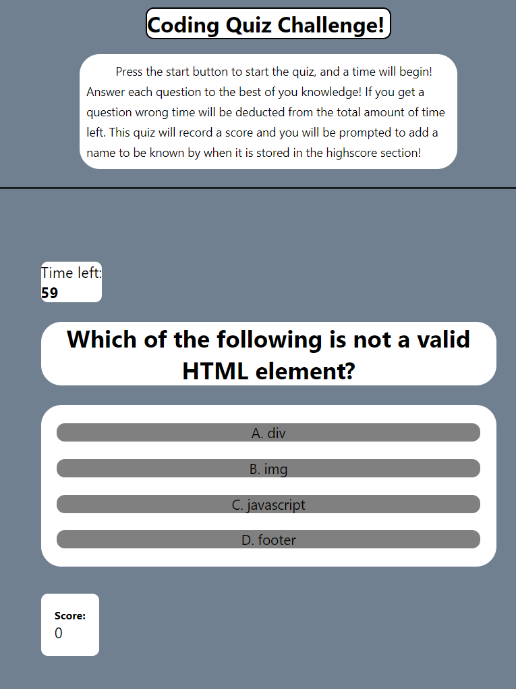

# Timed-Quiz

## About

A timed multiple choice quiz utilizing JavaScript and web api's. When the user opens the website they will be able to read a short description of the website, and press start. When the game has started you will have 60 seconds to answer the question as best you can. You will be scored based one how long it takes to answer the questions and wether or no the questions are answered correctly.

## Function  

    You can press the start button to play the game
    you can answer questions by clicking on them 
    you can save your finall score and compare scores to others who have used the site on that device

## Screenshot

## Link

[file:https://ttieman.github.io/timed-quiz/](doc:https://ttieman.github.io/timed-quiz/)

## License

    MIT

## Citing Credit

Web3 schools was used for referencing javascript elements while building this page!

 [https://www.w3schools.com/](doc:linking-to-reference#https://www.w3schools.com/)

## Wrapping Up 

This was my first project using web-apis

#

I used this project to further my understanding of how to alter the elemnts on screen using javascript. This was a difficult one, and I got stuck multiple times but was able to find soltiuns eventually. 
